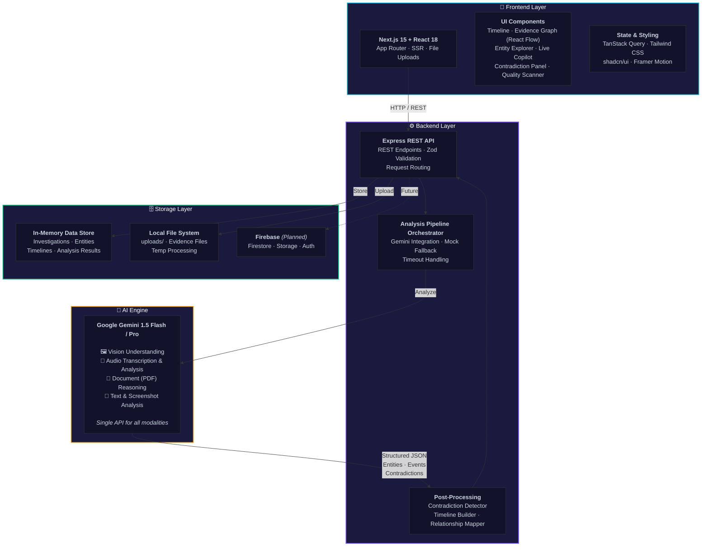
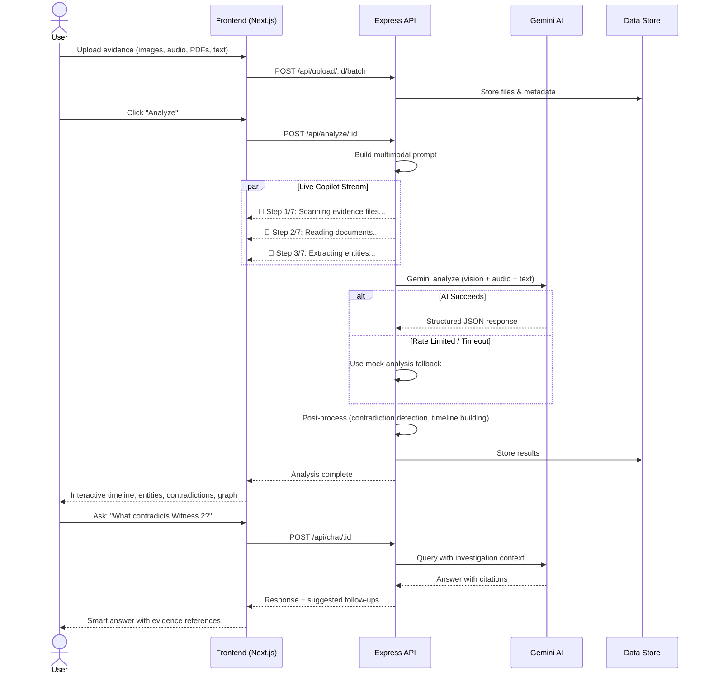

<div align="center">

# 🕵️ EchoTrace AI

**Multimodal Investigation Intelligence Platform**

> **Turn scattered evidence into an explainable investigation timeline.**

[](https://nextjs.org/)
[](https://react.dev/)
[](https://www.typescriptlang.org/)
[](https://tailwindcss.com/)
[](https://ai.google.dev/)
[](https://expressjs.com/)
[](https://firebase.google.com/)
[]()

<br>

<!-- Demo GIF placeholder - replace with actual screen recording -->
<a href="#">
  
</a>

<br>
<br>

[](https://github.com/Jacksonfio/EchoTrace/issues)
[](https://github.com/Jacksonfio/EchoTrace/issues)
[](https://vercel.com/new/clone?repository-url=https://github.com/Jacksonfio/EchoTrace)

</div>

---

## 📋 Table of Contents


[✨ Key Features](#-key-features) · [🏗️ Architecture](#%EF%B8%8F-architecture) · [🛠️ Tech Stack](#%EF%B8%8F-tech-stack) · [🚀 Quick Start](#-quick-start) · [📁 Structure](#-project-structure) · [📡 API](#-api-reference) · [🎯 Use Cases](#-use-cases) · [🗺️ Roadmap](#%EF%B8%8F-roadmap) · [🤝 Contribute](#-contributing)


---

## 🔍 Overview

EchoTrace AI is a **multimodal investigation assistant** that reconstructs event timelines from mixed evidence — photos, screenshots, voice notes, PDFs, maps, and text messages. Instead of acting as a simple chatbot, it functions as a **reasoning engine over heterogeneous evidence**, analyzing relationships across all uploaded files to detect contradictions, extract entities, and produce interactive timelines with confidence scores.

<table>
<tr>
<td width="50%" valign="top">

### ❌ The Problem
- Multiple tools needed for different evidence types
- Critical connections between evidence go undetected
- Contradictions found only during manual review
- Current AI tools are chatbots, not reasoning engines

</td>
<td width="50%" valign="top">

### ✅ Our Solution
- **Single platform** — upload all evidence modalities together
- **Cross-modal reasoning** — Gemini connects the dots
- **Real-time validation** — Live Copilot as you upload
- **Explainable AI** — every result cites source evidence

</td>
</tr>
</table>

---

## ✨ Key Features

<div align="center">
<table>
<tr>
<td align="center" width="25%">
<h3>🛡️</h3>
<h4>Live Claim Guardian</h4>
<p><sub>Real-time validation as each document uploads</sub></p>
</td>
<td align="center" width="25%">
<h3>⏱️</h3>
<h4>Interactive Timeline</h4>
<p><sub>Auto-built chronological events with confidence scores</sub></p>
</td>
<td align="center" width="25%">
<h3>⚡</h3>
<h4>Contradiction Detector</h4>
<p><sub>Cross-modal mismatches with severity grading</sub></p>
</td>
<td align="center" width="25%">
<h3>👤</h3>
<h4>Entity Extraction</h4>
<p><sub>People, vehicles, locations from any evidence type</sub></p>
</td>
</tr>
<tr>
<td align="center" width="25%">
<h3>📸</h3>
<h4>Quality Scanner</h4>
<p><sub>AI checks photos before you leave the scene</sub></p>
</td>
<td align="center" width="25%">
<h3>🤖</h3>
<h4>Live Copilot</h4>
<p><sub>Streaming analysis progress in real-time</sub></p>
</td>
<td align="center" width="25%">
<h3>📊</h3>
<h4>Confidence Meter</h4>
<p><sub>Dynamic scoring with detailed breakdowns</sub></p>
</td>
<td align="center" width="25%">
<h3>💬</h3>
<h4>AI Assistant</h4>
<p><sub>Ask: "What contradicts Witness 2?"</sub></p>
</td>
</tr>
</table>
</div>

---

## 🏗️ Architecture

The architecture follows a **4-layer design** with clear separation of concerns. Data flows from user uploads through the analysis pipeline and back to the interactive UI.



### 🔄 Data Flow



---

## 🛠️ Tech Stack

<div align="center">

### 🎨 Frontend

| Technology | Badge | Purpose |
|-----------|-------|---------|
| **Next.js 15** | [](https://nextjs.org/) | React framework with SSR & file-based routing |
| **React 18** | [](https://react.dev/) | UI component library |
| **TypeScript** | [](https://www.typescriptlang.org/) | End-to-end type safety |
| **Tailwind CSS 3** | [](https://tailwindcss.com/) | Utility-first design system |
| **shadcn/ui** | [](https://ui.shadcn.com/) | Enterprise-quality components |
| **Framer Motion** | [](https://www.framer.com/motion/) | Smooth animations & transitions |
| **React Flow** | [](https://reactflow.dev/) | Interactive evidence graph |
| **TanStack Query** | [](https://tanstack.com/query) | Server state & caching |

### ⚙️ Backend & AI

| Technology | Badge | Purpose |
|-----------|-------|---------|
| **Node.js** | [](https://nodejs.org/) | JavaScript runtime |
| **Express** | [](https://expressjs.com/) | REST API framework |
| **Gemini API 1.5** | [](https://ai.google.dev/) | Multimodal AI reasoning engine |
| **Zod** | [](https://zod.dev/) | Schema validation |
| **Concurrently** | [](https://www.npmjs.com/package/concurrently) | Parallel dev servers |

### 🗄️ Infrastructure

| Technology | Badge | Purpose |
|-----------|-------|---------|
| **Firebase Firestore** *(planned)* | [](https://firebase.google.com/) | NoSQL database |
| **Firebase Storage** *(planned)* | [](https://firebase.google.com/) | Evidence file hosting |
| **Firebase Auth** *(planned)* | [](https://firebase.google.com/) | Google Login authentication |

</div>

---

## 🚀 Quick Start

### Prerequisites

<div align="center">
  
[](https://nodejs.org/)
[](https://www.npmjs.com/)
[](https://aistudio.google.com/)
[](https://console.firebase.google.com/)

</div>

**Step 1 — Clone & Install**

```bash
git clone https://github.com/Jacksonfio/EchoTrace.git
cd EchoTrace
npm install
```

**Step 2 — Configure Environment**

```bash
cp .env.example .env
```

Edit `.env` with your API keys:

```env
GEMINI_API_KEY=your_gemini_api_key_here
GEMINI_MODEL=gemini-1.5-flash
PORT=3001
FRONTEND_URL=http://localhost:3000
```

**Step 3 — Launch**

```bash
# Start everything in one command
npm run dev
```

<div align="center">
<br>

| Service | URL |
|---------|-----|
| 🌐 **Frontend** | [http://localhost:3000](http://localhost:3000) |
| 🔌 **Backend API** | [http://localhost:3001](http://localhost:3001) |

<br>
</div>

**Step 4 — Load Demo Data**

1. Open the browser at `http://localhost:3000`
2. Click **"🚀 Load Demo Data"** in the sidebar
3. Select the **"Car Accident"** investigation
4. Click **"🔍 Analyze"** to run full analysis

<div align="center">
  
[](https://www.typescriptlang.org/)
[](https://nextjs.org/)

</div>

---

## 📁 Project Structure

```
echotrace/
├── 📂 apps/frontend/            # Next.js 15 Application
│   ├── src/
│   │   ├── app/                 # App Router pages (page.tsx, layout.tsx)
│   │   └── components/          # 15+ React Components
│   │       ├── AnalysisBar.tsx         # Live Copilot + Metrics
│   │       ├── ClaimConfidenceMeter.tsx # Dynamic confidence scoring
│   │       ├── ContradictionPanel.tsx   # Contradiction detection
│   │       ├── EntityRelations.tsx      # Entity explorer with filters
│   │       ├── EvidenceComparison.tsx   # Side-by-side comparison
│   │       ├── EvidenceQualityScanner.tsx # AI quality assessment
│   │       ├── EvidenceTimeline.tsx     # Interactive timeline
│   │       ├── LiveCopilot.tsx          # Real-time streaming
│   │       ├── EvidenceGraph.tsx        # React Flow relationship graph
│   │       ├── FloatingChat.tsx         # Smart investigation chat
│   │       ├── UploadZone.tsx           # Drag-and-drop upload
│   │       ├── CaseNotes.tsx            # Investigator notes
│   │       └── InvestigationSummary.tsx # Dashboard overview
│   ├── next.config.js
│   ├── tailwind.config.js
│   └── tsconfig.json
│
├── 📂 server/                   # Express Backend
│   ├── src/
│   │   ├── index.ts             # Server entry point
│   │   ├── routes/              # REST API routes
│   │   │   ├── investigations.ts  # CRUD operations
│   │   │   ├── analyze.ts         # Analysis pipeline
│   │   │   ├── upload.ts          # File upload handling
│   │   │   ├── chat.ts            # Investigation chat
│   │   │   └── seed.ts            # Demo data seeder
│   │   └── services/            # Core services
│   │       ├── gemini.ts         # Gemini API integration
│   │       ├── mockAnalysis.ts   # Offline analysis fallback
│   │       ├── analysis.ts       # Pipeline orchestrator
│   │       └── store.ts          # Data persistence
│   └── tsconfig.json
│
├── 📂 shared/                    # Shared Types & Prompts
│   └── types/
│       ├── index.ts              # Core interfaces & types
│       └── prompts.ts            # Gemini prompt templates
│
├── 📂 firebase/                  # Firebase config (WIP)
├── 📂 docs/                      # Documentation
├── 📂 scripts/                   # Utility scripts
├── 📂 uploads/                   # Uploaded evidence files
├── 📄 .env.example               # Environment template
├── 📄 .gitignore
├── 📄 package.json               # Workspace root
├── 📄 LICENSE                    # MIT License
└── 📄 README.md                  # You are here
```

---

## 📡 API Reference

### Investigations

```http
POST   /api/investigations          # Create investigation
GET    /api/investigations          # List all investigations
GET    /api/investigations/:id      # Get details (entities, timeline, contradictions)
DELETE /api/investigations/:id      # Delete investigation
DELETE /api/investigations          # Clear all investigations
```

### Evidence & Analysis

```http
POST   /api/upload/:id/batch        # Upload evidence files
POST   /api/analyze/:id             # Run AI analysis
POST   /api/chat/:id                # Ask investigation questions
```

### Response Format

All responses follow a consistent structure:

```json
{
  "success": true,
  "data": {
    "entities": [
      { "id": "ent-1", "type": "Person", "name": "Unknown Male", "confidence": 92 },
      { "id": "ent-2", "type": "Vehicle", "name": "Dark Gray SUV", "confidence": 87 }
    ],
    "events": [
      { "id": "evt-1", "time": "08:42", "description": "Vehicle arrives", "confidence": 94 }
    ],
    "contradictions": [
      { "id": "con-1", "description": "Witness says blue car, photo shows gray SUV", 
        "severity": "high", "confidence": 90 }
    ],
    "relationships": [
      { "id": "rel-1", "source": "ent-1", "target": "ent-2", "relation": "associated_with" }
    ]
  },
  "error": null
}
```

---

## 🎯 Use Cases

<div align="center">
<table>
<tr>
<td align="center" width="16%">🚗</td>
<td align="center" width="16%">🔍</td>
<td align="center" width="16%">📰</td>
<td align="center" width="16%">🏢</td>
<td align="center" width="16%">👮</td>
<td align="center" width="16%">🔐</td>
</tr>
<tr>
<td align="center"><b>Insurance</b><br><sub>Real-time claim validation & fraud detection</sub></td>
<td align="center"><b>Missing Persons</b><br><sub>Cross-reference photos, statements, GPS</sub></td>
<td align="center"><b>Journalism</b><br><sub>Verify sources & detect manipulation</sub></td>
<td align="center"><b>Corporate</b><br><sub>Incident documentation & compliance</sub></td>
<td align="center"><b>Law Enforcement</b><br><sub>Evidence organization & timeline</sub></td>
<td align="center"><b>Cybersecurity</b><br><sub>Post-incident correlation & reporting</sub></td>
</tr>
</table>
</div>

### 📊 Measurable Impact

- ⚡ **70% faster** evidence organization vs. manual methods
- 🔍 **Real-time contradiction detection** — catch mismatches instantly
- 📸 **AI-guided evidence collection** — reduces resubmission rates
- 📋 **Explainable AI** — every result cites source evidence with confidence scores

---

## 🗺️ Roadmap

<div align="center">

### ✅ Completed (MVP)

| Feature | Status |
|---------|--------|
| Drag-and-drop evidence upload | ✅ |
| Gemini multimodal analysis pipeline | ✅ |
| Entity extraction (people, vehicles, locations) | ✅ |
| Automatic timeline generation | ✅ |
| Contradiction detection with severity | ✅ |
| Interactive evidence graph (React Flow) | ✅ |
| Live Copilot streaming | ✅ |
| Evidence quality scanner | ✅ |
| Claim confidence meter | ✅ |
| Smart investigation chat | ✅ |
| Case notes with persistence | ✅ |
| Side-by-side evidence comparison | ✅ |
| Dark theme professional UI | ✅ |

### 🔜 In Progress

- [ ] Real-time evidence capture assistant
- [ ] Environmental context verification (weather, traffic APIs)
- [ ] Duplicate claim detection
- [ ] Automated PDF report generation

### 🔮 Future

- [ ] Mobile app for on-scene collection
- [ ] Multi-user collaboration & role-based access
- [ ] WebSocket/Socket.IO for true streaming
- [ ] Video frame extraction & analysis
- [ ] Police & insurance database integration

</div>

---

## 🤝 Contributing

Contributions make this project better! Here's how:

1. 🍴 **Fork** the repository
2. 🌿 **Create** a feature branch: `git checkout -b feature/amazing-feature`
3. 💾 **Commit** your changes: `git commit -m 'Add amazing feature'`
4. 📤 **Push** to the branch: `git push origin feature/amazing-feature`
5. 🔃 **Open** a Pull Request

```bash
# Check types before submitting
npm run typecheck
```

---

## 📄 License

<div align="center">

**MIT License** — Copyright © 2026 [Jackson JP](https://github.com/Jacksonfio)

*Built with ❤️ at [Panimalar Engineering College](https://www.panimalar.ac.in/)*

**Powered by** [](https://ai.google.dev/)
[](https://nextjs.org/)
[](https://firebase.google.com/)

</div>
